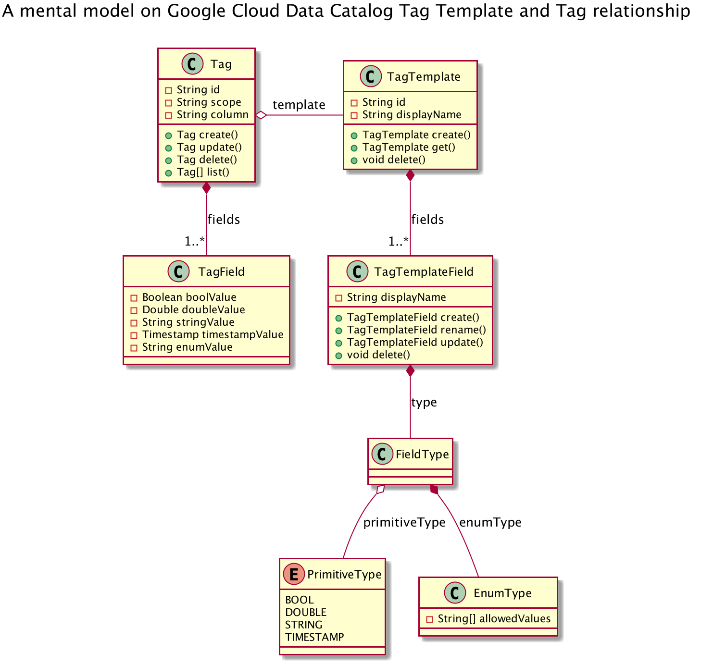

# gcp-data-catalog-diagrams

Diagrams that help to clarify Google Cloud Data Catalog core features.

> Disclaimer: this is my personal way of thinking, as a Data Catalog early
>adopter — only & simply this. The model is not based on any official/supported
>reference.

## To understand the context...

- [Data Catalog hands-on guide: a mental model][1]
@ Google Cloud Community / Medium

- [Data Catalog hands-on guide: search, get & lookup with Python][2]
@ Google Cloud Community / Medium

- [Data Catalog hands-on guide: templates & tags with Python][3]
@ Google Cloud Community / Medium

## 1. Entity Model

### 1.1. Core entities

### 1.2. Search Catalog & Lookup Entry related entities

### 1.3. Tag Template & Tag relationship

### 1.4. Entry, Tag & Tag Template relationships

[1]: https://medium.com/google-cloud/data-catalog-hands-on-guide-a-mental-model-dae7f6dd49e
[2]: https://medium.com/google-cloud/data-catalog-hands-on-guide-search-get-lookup-with-python-82d99bfb4056
[3]: https://medium.com/google-cloud/data-catalog-hands-on-guide-templates-tags-with-python-c45eb93372ef
