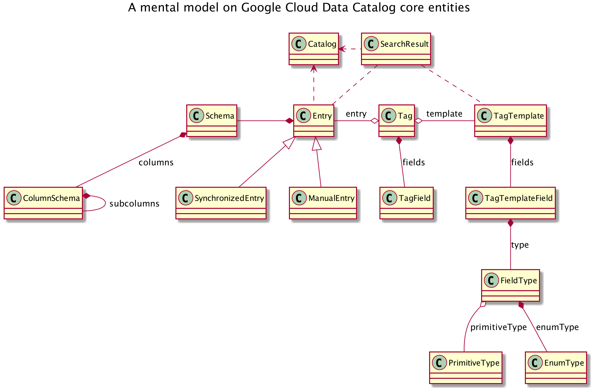
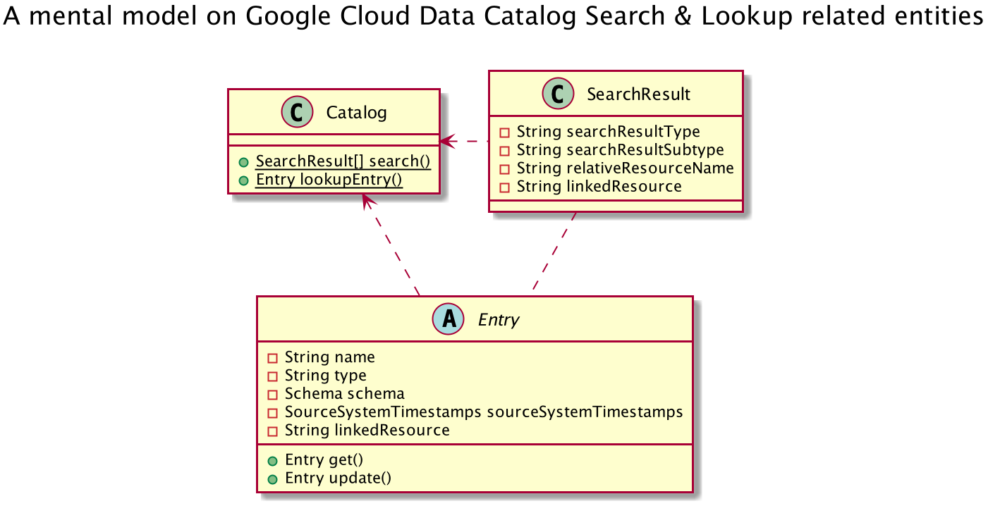

# gcp-datacatalog-diagrams

Diagrams that help to clarify Google Cloud Data Catalog core features.

> Disclaimer: this is my personal way of thinking, as a Data Catalog early
> adopter — only & simply this. The model is not based on any official/supported
> reference.

## To understand the context

- [Data Catalog hands-on guide: a mental model][1]
  @ Google Cloud Community / Medium

- [Data Catalog hands-on guide: search, get & lookup with Python][2]
  @ Google Cloud Community / Medium

- [Data Catalog hands-on guide: templates & tags with Python][3]
  @ Google Cloud Community / Medium

## Entity Model

### Core entities

### Search Catalog & Lookup Entry related entities

### Tag Template & Tag relationship

### Entry, Tag & Tag Template relationships

## How to contribute

Please make sure to take a moment and read the [Code of
Conduct](https://github.com/ricardolsmendes/gcp-datacatalog-diagrams/blob/master/.github/CODE_OF_CONDUCT.md).

### Report issues

Please report bugs and suggest features via the [GitHub
Issues](https://github.com/ricardolsmendes/gcp-datacatalog-diagrams/issues).

Before opening an issue, search the tracker for possible duplicates. If you find a duplicate, please
add a comment saying that you encountered the problem as well.

### Contribute code

Please make sure to read the [Contributing
Guide](https://github.com/ricardolsmendes/gcp-datacatalog-diagrams/blob/master/.github/CONTRIBUTING.md)
before making a pull request.

[1]: https://medium.com/google-cloud/data-catalog-hands-on-guide-a-mental-model-dae7f6dd49e
[2]: https://medium.com/google-cloud/data-catalog-hands-on-guide-search-get-lookup-with-python-82d99bfb4056
[3]: https://medium.com/google-cloud/data-catalog-hands-on-guide-templates-tags-with-python-c45eb93372ef
